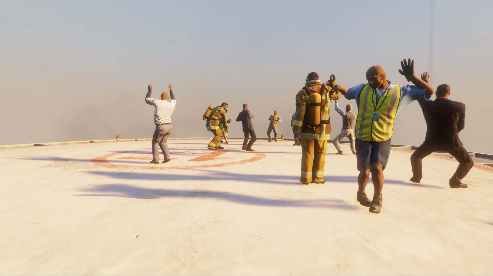

# Dancing Plague
A mod that makes all male NPCs dance as long as the H key is pressed.

TRAILER:
https://youtu.be/wtrvN_u4ksA

INSTALLATION:
- Copy "DancingPlague.dll" and the "dancingPlague" folder into your scripts folder (if you don't have one, create it) in your GTA V root folder.

USAGE:
- Press and hold H to start Dancing Plague.

REQUIREMENTS:
- [Script Hook V](http://www.dev-c.com/gtav/scripthookv/)
- [Script Hook V Dot Net](https://github.com/crosire/scripthookvdotnet/releases)

MUSIC:
Magnetic Service (Extended Version) composed & produced by Azu Tiwaline with the authorisation of Livity Sound & Cylid Publishing.

